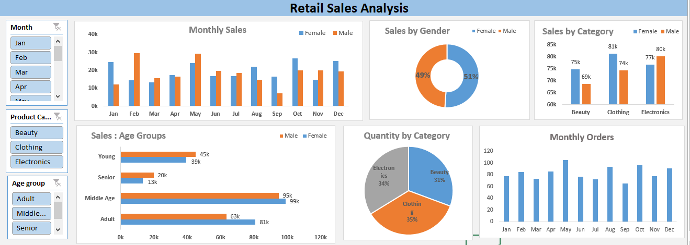

### Overview
 
This project analyzes retail sales data using Microsoft Excel. The objective is to understand sales trends, customer behavior, and product performance.

Data Preparation :

- Removed missing values and duplicates  
- Validated total sales using quantity and price  
- Created additional columns such as Month, Year, and Age Group  

Insights : 

- Electronics is the top-performing category and contributes the highest sales.  
- Female customers contribute slightly more to total sales compared to male customers.  
- The middle age group generates the highest sales among all age groups.  
- Sales change across different months and are not constant.  
- Some months show higher sales, indicating peak demand periods.  

Tool  
  Microsoft Excel 

Dashboard

Conclusion 

This project helped in understanding sales trends, customer behavior, and product performance. It also improved practical skills in Excel data analysis.
